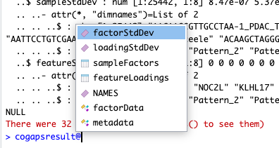

---

hero_image: /CoGAPS/images/hero.jpg
<!-- hero_height: is-fullwidth -->
hero_darken: true

---

# Anticipated Results

The output you should obtain from a PyCoGAPS run (Procedure 1A/B or Procedure 3) is an anndata object, stored as an .h5ad file. In the anndata object, the lower dimensional representation of the samples (P matrix) is stored in the .var slot and the weight of the features (A matrix) is stored in the .obs slot. For an m by p dimension gene expression input, the P matrix or .var slot should have dimension m by k, and the A matrix or .obs slot should have dimension k by p, where k is the number of patterns.

Further metrics are stored in the .uns slot of the result object. This includes standard deviations across the sample points for both the P and A matrix stored in “psd” and “asd” respectively, the mean chi squared value stored in “meanchisq”, the total running time stored in “totalRunningTime” and more. An example output including all metadata can be found in **Box 18**.

---

**Box 18: PyCoGAPS Anndata Result & Metadata**

```py
AnnData object with n_obs × n_vars = 15219 × 25442
    obs: 'Pattern1', 'Pattern2', 'Pattern3', 'Pattern4', 'Pattern5', 'Pattern6', 'Pattern7', 'Pattern8'
    var: 'Pattern1', 'Pattern2', 'Pattern3', 'Pattern4', 'Pattern5', 'Pattern6', 'Pattern7', 'Pattern8'
    uns: 'asd', 'atomhistoryA', 'atomhistoryP', 'averageQueueLengthA', 'averageQueueLengthP', 'chisqHistory', 'equilibrationSnapshotsA', 'equilibrationSnapshotsP', 'meanChiSq', 'meanPatternAssignment', 'psd', 'pumpMatrix', 'samplingSnapshotsA', 'samplingSnapshotsP', 'seed', 'totalRunningTime', 'totalUpdates'
    varm: 'X_aligned', 'X_pca', 'X_umap'
```

---

The output you should obtain from a CoGAPS run (Procedure 2) is an .Rds file. In this object, the lower dimensional representation of the samples (P matrix) is stored in the “**featureLoadings**” slot and the weight of the features (A matrix) is stored in the “**sampleFactors**” slot. For an m by p dimension gene expression input, the P matrix should have dimension m by k, and the A matrix should have dimension k by p, where k is the number of patterns.

Standard deviation matrices are stored in the slots “**factorStdDev**” and “**loadingStdDev**” corresponding to sampleFactors and featureLoadings.

Additionally, metadata contains information for the run such as how it was parallelized stored in “**subsets**”, the mean ChiSq value during the run stored in “**meanChiSq**”, and the parameters used in the run stored in “**params**”. Other information may be present in the metadata depending on your run options shown in **Box 19**.

---

**Box 19: CoGAPS Result & Metadata**

```r
> cogapsresult
[1] "CogapsResult object with 15176 features and 25442 samples"
[1] "8 patterns were learned"
```



```r
> names(cogapsresult@metadata)
[1] "meanChiSq"         "firstPass"         "unmatchedPatterns" "clusteredPatterns"
[5] "CorrToMeanPattern" "subsets"           "params"            "version"          
[9] "logStreamName"
```

---

Once the result object is obtained, the user may follow the steps in any of the three procedures (Python, R, or GenePattern) in “Analyzing the PyCoGAPS/CoGAPS result” for interpretation.

Because CoGAPS uses MCMC sampling to find the values of the A and P matrices, the results are stochastic. While results will vary between simulations, we have observed that solutions from multiple runs tend to have qualitatively similar gene signatures and cell weights in permuted pattern order. For reproducibility of CoGAPS results, we recommend setting the seed for each run and saving CoGAPS results after completion of the run as an intermediate object prior to interpretation.
