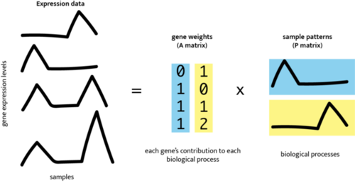

---

layout: page
title: CoGAPS
subtitle: (Coordinated Gene Association in Pattern Sets)
hero_image: /CoGAPS/images/hero.jpg
<!-- hero_height: is-fullwidth -->
hero_darken: true
show_sidebar: false
hero_link: https://github.com/FertigLab/CoGAPS
hero_link_text: GitHub Repository

---

<!--  -->

# Introduction

Non-negative matrix factorization (NMF) is an unsupervised learning method well suited to high-throughput biology. Still, inferring biological processes requires additional post hoc statistics and annotation for interpretation of features learned from software packages developed for NMF implementation. Here, we aim to introduce a suite of computational tools that implement NMF and provide methods for accurate, clear biological interpretation and analysis. A generalized discussion of NMF covering its benefits, limitations, and open questions in the field is followed by three procedures for the Bayesian NMF algorithm CoGAPS (Coordinated Gene Activity across Pattern Subsets). Each procedure will demonstrate NMF analysis to quantify cell state transitions in public domain single-cell RNA-sequencing (scRNA-seq) data of 25,422 epithelial cells from pancreatic ductal adenocarcinoma (PDAC) tumors and control samples. The first demonstrates PyCoGAPS, our new Python implementation of CoGAPS that enhances runtime of Bayesian NMF for large datasets. The second procedure steps through the same single-cell NMF analysis using our R CoGAPS interface, and the third introduces a beginner-friendly CoGAPS platform using GenePattern Notebook. By providing Python support, cloud-based computing options, and relevant example workflows, we facilitate user-friendly interpretation and implementation of NMF for single-cell analyses. The expected timing to properly setup the packages and conduct a test run is around 15 minutes, and an additional 30 minutes to conduct analyses on a precomputed result. The expected runtime on the user’s desired dataset can vary from hours to days depending on factors such as the size of the dataset or input parameters.

<figcaption>NMF factorizes expression data into lower-dimensional amplitude (A) gene weights matrix and pattern (P) weights matrix whose product approximates the input.</figcaption>

## Citing CoGAPS

If you use the CoGAPS package for your analysis, please cite Fertig et al. (2010)

If you use the gene set statistic, please cite Ochs et al. (2009)
