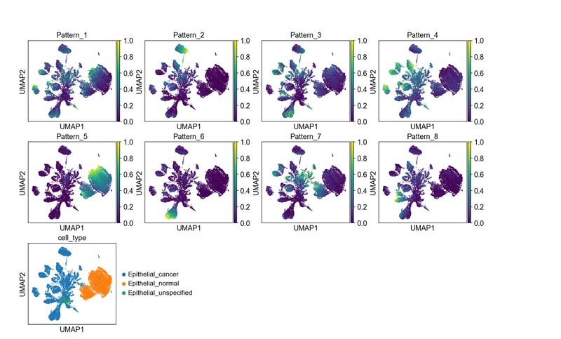
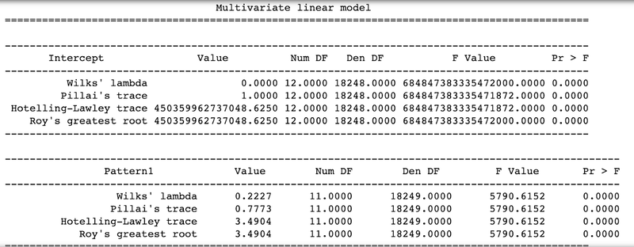
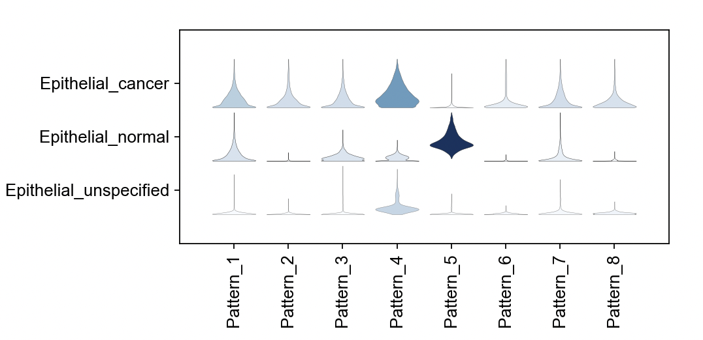
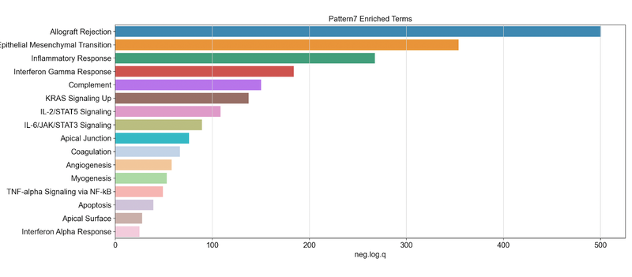
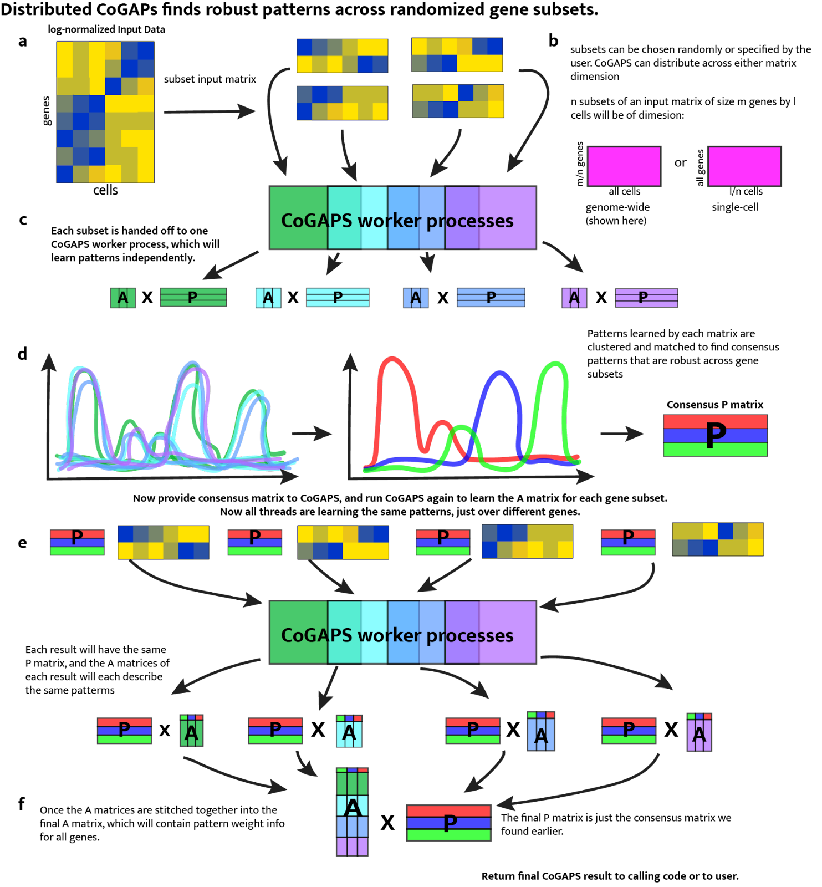

---

hero_image: /CoGAPS/images/hero.jpg
<!-- hero_height: is-fullwidth -->
hero_darken: true
subtitle: User Startup Guide
toc: true

---

# Python Scripts

## Software Setup

<strong>Timing: 5-10 min</strong>

1 . To download PyCoGAPS from **GitHub** with all data included (~2 GB memory), please **run the following command**, otherwise to omit the data, please refer to **Box 2**:

```yml
git clone <a href="https://github.com/FertigLab/pycogaps.git" target="_blank">https://github.com/FertigLab/pycogaps.git</a> --recursive
```

<strong><a href="/CoGAPS/troubleshooting/#procedure-1a" target="_blank">TROUBLESHOOTING</a></strong>

---

<strong>Box 2</strong>

To download PyCoGAPS without the large files (inputresult.h5ad and cogapsresult.h5ad), **run the following command**:

```yml
GIT_LFS_SKIP_SMUDGE=1 git clone https://github.com/FertigLab/pycogaps.git --recursive
```

Please note that if you would like to use the files (inputresult.h5ad and cogapsresulth5ad) later, you may download them from the [GitHub repository](https://github.com/FertigLab/pycogaps).

---

Expected output:

```yml
Cloning into 'pycogaps'...
remote: Enumerating objects: 1570, done.
remote: Counting objects: 100% (290/290), done.
remote: Compressing objects: 100% (191/191), done.
remote: Total 1570 (delta 160), reused 154 (delta 97), pack-reused 1280
Receiving objects: 100% (1570/1570), 8.97 MiB | 15.06 MiB/s, done.
Resolving deltas: 100% (950/950), done.
Filtering content: 100% (4/4), 2.29 GiB | 21.49 MiB/s, done.
Submodule 'src/CoGAPS' (https://github.com/FertigLab/CoGAPS.git) registered for path 'src/CoGAPS'
Cloning into '/Users/fertiglab/pycogaps/src/CoGAPS'...
remote: Enumerating objects: 16976, done.        
remote: Counting objects: 100% (343/343), done.        
remote: Compressing objects: 100% (156/156), done.        
remote: Total 16976 (delta 201), reused 312 (delta 187), pack-reused 16633        
Receiving objects: 100% (16976/16976), 177.58 MiB | 6.10 MiB/s, done.
Resolving deltas: 100% (10621/10621), done.
Submodule path 'src/CoGAPS': checked out 'e1e002caa009866d41402f3aa5ad3f97b541d962'
```

2 . Install the required package dependencies with the following command. We recommend installing these dependencies in an **Anaconda<sup>70</sup> environment(Box 3)**:

```yml
cd pycogaps
pip install -r requirements.txt
```

---

<strong>Box 3: Anaconda Environment</strong>

Install Anaconda from here: <a href="https://docs.anaconda.com/anaconda/install/" target="_blank">docs.anaconda.com/anaconda/install/</a>

Instructions for setting up a conda environment can be found here: <a href="https://conda.io/projects/conda/en/latest/user-guide/getting-started.html" target="_blank">conda.io/projects/conda/en/latest/user-guide/getting-started.html</a>

We recommend the user create a conda environment called ‘**pycogaps**’ and install all requirements and run code from within here.

<strong><a href="/CoGAPS/troubleshooting/#procedure-1a" target="_blank">TROUBLESHOOTING</a></strong>

---

Now run the **setup script**. This installs the **C++ core CoGAPS library**.

```yml
python3 setup.py install
```

When PyCoGAPS has installed and built correctly, you should see this message, indicating **PyCoGAPS is ready to use**:

```yml
Finished processing dependencies for pycogaps==0.0.1
```

<strong><a href="/CoGAPS/troubleshooting/#procedure-1a" target="_blank">TROUBLESHOOTING</a></strong>

## Running PyCoGAPS

<strong>[this code can be found in the reference file modsimvignette.py]</strong>

<strong>Timing: 3-5 min</strong>

To ensure PyCoGAPS is running properly on your computer, we will first perform a setup and run on a small, simulated toy dataset (single-cell data analysis will begin in <a href="CoGAPS/optiona/#running-pycogaps-on-single-cell-data">Step 7</a>). 

3 . **Import libraries**. In your python script (file ending in .py), import the PyCoGAPS functions with the following lines:

```yml
from PyCoGAPS.parameters import *
from PyCoGAPS.pycogaps_main import CoGAPS
import scanpy as sc
```

4 . Load sample data from directory.

```yml
modsimpath = "data/ModSimData.txt"
modsim = sc.read_text(modsimpath)
```

Examining the new modsim object in the python console, we see it is an Anndata object of dimension 25 x 20. 

```yml
modsim
AnnData object with n_obs × n_vars = 25 × 20
```

5 . Next, we will set the parameters to be used by PyCoGAPS. First, we will **create a CoParams object**, then **set parameters with the setParams function**. 

```yml
params = CoParams(path=modsimpath)
params.printParams()
```

printParams() displays all parameters currently set for the parameter object. Since we just generated this object using the constructor, **all default parameters are currently set**.

```yml
-- Standard Parameters --
nPatterns:  3
nIterations:  1000
seed:  0
sparseOptimization:  False
-- Sparsity Parameters --
alpha: 0.01
maxGibbsMass:  100.0
```

Since we want to simulate a full-length run on this very small matrix, we need to change **nIterations**. Many parameters can be changed at once using this dictionary syntax:

```yml
setParams(params, {
    'nIterations': 50000,
    'seed': 42,
    'nPatterns': 3
})
```

For now, we will only modify the ‘**nIterations**’, ‘**seed**’, and ‘**nPatterns**’ parameters. 
Setting the seed fixes the random number generator so that the stochastic, MCMC algorithm used to solve for the A and P matrices in CoGAPS provides identical solutions between runs. More description of the parameters and parameter tuning can be found in <a href="/CoGAPS/optiona/#table-2-key-parameters-for-cogapspycogaps-and-guidance-on-setting-their-values">Table 2</a>. 

Verify nIterations was updated as anticipated:

```yml
>> params.printParams()

-- Standard Parameters --
nPatterns:  3
nIterations:  50000
seed:  42
sparseOptimization:  False
-- Sparsity Parameters --
alpha: 0.01
maxGibbsMass:  100.0
```

6 . Since our parameters and data are now ready, we can start our **PyCoGAPS run**. As a best practice, we recommend always timing CoGAPS runs for your own records.

```yml
start = time.time()
modsimresult = CoGAPS(modsim, params)
print("TIME:", end - start)
```

Since modsim is a small, toy dataset, the expected runtime is only about **3 seconds**. Verify that the following output appears:

```yml
This is pycogaps version  0.0.1

Running Standard CoGAPS on provided data object ( 25 genes and 20 samples) with parameters: 


-- Standard Parameters --
nPatterns:  3
nIterations:  50000
seed:  42
sparseOptimization:  False
-- Sparsity Parameters --
alpha: 0.01
maxGibbsMass:  100.0
Data Model: Dense, Normal
Sampler Type: Sequential
Loading Data...Done! (00:00:00)
-- Equilibration Phase --
1000 of 50000, Atoms: 41(A), 37(P), ChiSq: 3076, Time: 00:00:00 / 00:00:00
2000 of 50000, Atoms: 51(A), 39(P), ChiSq: 1764, Time: 00:00:00 / 00:00:00
3000 of 50000, Atoms: 53(A), 41(P), ChiSq: 892, Time: 00:00:00 / 00:00:00
4000 of 50000, Atoms: 50(A), 42(P), ChiSq: 695, Time: 00:00:00 / 00:00:00
5000 of 50000, Atoms: 52(A), 44(P), ChiSq: 519, Time: 00:00:00 / 00:00:00
[ … ]
45000 of 50000, Atoms: 72(A), 51(P), ChiSq: 107, Time: 00:00:00 / 00:00:00
46000 of 50000, Atoms: 78(A), 52(P), ChiSq: 128, Time: 00:00:00 / 00:00:00
47000 of 50000, Atoms: 79(A), 48(P), ChiSq: 95, Time: 00:00:00 / 00:00:00
48000 of 50000, Atoms: 71(A), 56(P), ChiSq: 136, Time: 00:00:00 / 00:00:00
49000 of 50000, Atoms: 72(A), 47(P), ChiSq: 143, Time: 00:00:00 / 00:00:00
50000 of 50000, Atoms: 69(A), 53(P), ChiSq: 131, Time: 00:00:00 / 00:00:00
-- Sampling Phase --
1000 of 50000, Atoms: 74(A), 55(P), ChiSq: 104, Time: 00:00:00 / 00:00:00
2000 of 50000, Atoms: 75(A), 55(P), ChiSq: 123, Time: 00:00:00 / 00:00:00
3000 of 50000, Atoms: 87(A), 49(P), ChiSq: 101, Time: 00:00:00 / 00:00:00
4000 of 50000, Atoms: 82(A), 47(P), ChiSq: 102, Time: 00:00:00 / 00:00:00
5000 of 50000, Atoms: 82(A), 44(P), ChiSq: 100, Time: 00:00:00 / 00:00:00
[ … ]
45000 of 50000, Atoms: 71(A), 52(P), ChiSq: 132, Time: 00:00:01 / 00:00:01
46000 of 50000, Atoms: 68(A), 50(P), ChiSq: 130, Time: 00:00:01 / 00:00:01
47000 of 50000, Atoms: 75(A), 51(P), ChiSq: 140, Time: 00:00:01 / 00:00:01
48000 of 50000, Atoms: 74(A), 51(P), ChiSq: 108, Time: 00:00:01 / 00:00:01
49000 of 50000, Atoms: 74(A), 52(P), ChiSq: 108, Time: 00:00:01 / 00:00:01
50000 of 50000, Atoms: 81(A), 47(P), ChiSq: 108, Time: 00:00:01 / 00:00:01

GapsResult result object with 25 features and 20 samples
3 patterns were learned
```

Now we’ll take a quick look at the result object, to make sure there are **two resulting base matrices filled with plausible values**.

```yml
>> modsimresult
AnnData object with n_obs × n_vars = 25 × 20
    obs: 'Pattern1', 'Pattern2', 'Pattern3'
    var: 'Pattern1', 'Pattern2', 'Pattern3'
    uns: 'asd', 'psd', 'atomhistoryA', 'atomhistoryP', 'averageQueueLengthA', 'averageQueueLengthP', 'chisqHistory', 'equilibrationSnapshotsA', 'equilibrationSnapshotsP', 'meanChiSq', 'meanPatternAssignment', 'pumpMatrix', 'samplingSnapshotsA', 'samplingSnapshotsP', 'seed', 'totalRunningTime', 'totalUpdates'

>> modsimresult.obs.head()

    Pattern1  Pattern2  Pattern3
0  11.975077  0.101262  0.419482
1  10.741890  0.125388  1.356528
2   8.950110  0.035884  2.792770
3   7.521177  0.019195  3.895204
4   6.137812  0.014312  4.937158

>> modsimresult.var.head()

   Pattern1  Pattern2  Pattern3
0  0.001125  0.000760  0.013232
1  0.075658  0.000514  0.135343
2  0.341718  0.002400  0.604787
3  0.567491  0.004287  1.000000
4  0.391151  0.002598  0.640158
```

This indicates that PyCoGAPS has been **set up and run correctly**, and we can now proceed to analyzing **experimental single-cell data**.

## Running PyCoGAPS on Single Cell Data

<strong>[this code can be found in the reference file pdacvignette.py]</strong>

<strong>Timing: 5 min - 2 days (depending on whether user runs NMF or uses precomputed result)</strong>

7 . Import necessary libraries wrapped in check (**Box 4**):

```yml
if __name__ == "__main__":
    		from PyCoGAPS.parameters import *
   		from PyCoGAPS.pycogaps_main import CoGAPS
    		import scanpy as sc
```

---

<strong>Box 4: Handling multithreading for single-cell data</strong>

Important: Whenever distributed (ie multithreaded) options are used, all calling code **must** be wrapped in a check like this so it will only be called by the parent process. **Missing this line will send calling code into infinite recursion**. All subsequent calling code, not just the imports, **must** fall under this check such that it will only be executed when the check succeeds.

NOTE: Single-threaded CoGAPS, such as the run demonstrated above with ModSim data, does **not** require this check. It is a perfectly valid and correct way to run CoGAPS. We show distributed-friendly code here because it will be relevant to the majority of single-cell analysis users, who stand to gain both in performance and robustness of solution.

---

8 . A single-cell dataset has been provided for this vignette, already located in the ‘data’ folder when we cloned the repository. We will read in the data as an anndata object (**Box 5**).

```yml
path = "data/inputdata.h5ad"
adata = sc.read_h5ad(path)
```

---

<strong>Box 5: Data input format</strong>

While CoGAPS can handle multiple data formats, we **strongly** recommend converting your data to Anndata format using the **anndata package61** or another utility designed for translating between data structures62. The returned object will be in **Anndata format**.

---

9 . It is **strongly** recommended to normalize data before running PyCoGAPS. The data matrix is stored in Sparse Compressed Row format, and we now **decompress** and **normalize** it. Here we make use of the scanpy package<sup>71</sup> to perform **log-normalization**.

```yml
sc.pp.log1p(adata)

adata.X = adata.X.todense()
sc.pp.log1p(adata)
```

CoGAPS expects genes in .obs and cells in .var, which is the opposite of scanpy’s convention. So after normalizing, we transpose the matrix into CoGAPS expected format. 

```yml
adata = adata.T
```

Now let's examine **adata**:

```yml
>> adata
AnnData object with n_obs × n_vars = 15219 × 25442
    obs: 'gene_ensembl_ID', 'gene_short_name', 'feature_in_nCells'
    var: 'barcode_raw', 'celltype', 'sample_ID', 'sample_ID_celltype', 'TN', 'TN_manuscript', 'manuscript', 'nCount_RNA', 'nFeature_RNA', 'percent.mt', 'Size_Factor', 'TN_cluster_resolution_5', 'TN_assigned_cell_type', 'TN_assigned_cell_type_immune', 'TN_assigned_cell_type_immune_specific', 'TN_assigned_cell_type_immune_broad', 'cc', 'ccstage', 'Classifier_T_duct', 'Classifier_T_Fibroblast_only', 'Classifier_T_Fibroblast_Stellate'
    uns: 'log1p'
    varm: 'X_aligned', 'X_pca', 'X_umap'
```

This is an anndata object consisting of scRNAseq data from 25,422 Pancreatic epithelial cells, with reads from 15,219 genes. The .obs and .var matrices contain metadata such as **gene names**, **cell annotations**, and **clustering results**.

<strong>!CRITICAL</strong> - Any transformation or scaling you choose to perform on your count matrix **must** result in all non-negative values due to the core constraint of NMF.

10 . Next we create a parameters object that stores run options in a dictionary format. 

Note that the easiest way to decrease runtime is to **run for fewer iterations**, and you may want to set nIterations=1000 for a test run before starting a complete CoGAPS run on your data.

```yml
params = CoParams(adata=adata)

setParams(params, {
    'nIterations': 50000,
    'seed': 42,
    'nPatterns': 8,
    'useSparseOptimization': True,
    'distributed': "genome-wide"
})
```

If you are running distributed, you **must** run this line, and you can specify how many sets will be created and parallelized across, as well as specify cutoffs for how stringently a consensus matrix is determined. 

```yml
params.setDistributedParams(nSets=7)
```

The ‘distributed’ parameter enables parallelization to **decrease runtimes** which we recommended for most cases. Please refer to **Box 6** for how to run distributed PyCoGAPS.

---

<strong>Box 6: Running Distributed PyCoGAPS</strong>

Distributed parameters:

If you wish to run distributed CoGAPS, which we recommend for most cases, set the “distributed” parameter to “**genome-wide**” (parallelize across genes), or “**single-cell**” (parallelize across cells). Please see <a href="/CoGAPS/optiona/#figure-3">Fig. 3</a> for a full explanation of the mechanism. 

<sub>cut, minNS,</sub> and <sub>maxNS</sub> control the process of matching patterns across subsets and in general **should not** be changed from defaults. More information about these parameters can be found in the **original papers**.

```ymlnSets``` controls how many subsets are run in parallel when using the distributed version of the algorithm. Setting <sub>nSets</sub> requires balancing available hardware and run time against the size of your data. In general, <sub>nSets</sub> should be **less than** or **equal to** the number of nodes/cores that are available. If that is true, then the **more** subsets you create, the **faster** CoGAPS will run - however, **some robustness can be lost when the subsets get too small**. The general rule of thumb is to set <sub>nSets</sub> so that each subset has between 1000 and 5000 genes or cells in order to give robust results, but ideally we would want as many cells per set as possible. More information on these parameters can be found in <a href="/CoGAPS/optiona/#table-2-key-parameters-for-cogapspycogaps-and-guidance-on-setting-their-values">Table 2</a>.

If <sub>explicitSets</sub> are not provided, the data will be randomly fragmented into the number of sets specified by <sub>nSets</sub> parameter, with the default being 4. Subsets can also be chosen randomly, but weighted according to a user-provided annotation in parameters <sub>samplingAnnotation</sub> and <sub>samplingWeight</sub>.

---

<strong>!CRITICAL</strong> - If you are using the distributed CoGAPS option, all of your calling code must be wrapped in a check to make sure the main thread is running (demonstrated in Step 7). Otherwise, child processes will attempt to call this code, because none of them actually “know” they are not the main thread. This causes infinite recursion to occur and makes the program unrunnable. 

A description and guide for setting key PyCoGAPS parameters can be found in Table 2. To view the parameter values that have been set, we include a printParams function (Box 7). There are many more additional parameters that can be set depending on your goals, which we invite the reader to explore in our GitHub documentation.

---

<strong>Box 7: Viewing all Parameters</strong>

To see all parameters that have been set, call:

```yml
params.printParams()
```

Expected output:

```yml
running genome-wide. if you wish to perform single-cell distributed cogaps, please run setParams(params, "distributed", "single-cell")
setting distributed parameters - call this again if you change nPatterns

-- Standard Parameters --
nPatterns:  8
nIterations:  50000
seed:  42
sparseOptimization:  True

-- Sparsity Parameters --
alpha: 0.01
maxGibbsMass:  100.0

-- Distributed Parameters --
cut:  8
nSets:  7
minNS:  4
maxNS:  11
```

---

11 . With all parameters set, we are now ready to run PyCoGAPS. Please note that this is the most time-consuming step of the procedure. Timing can take several hours and scales nlog(n) based on dataset size (see Timing section below), as well as the parameter values set for ‘nPatterns’ and ‘nIterations’. Time is increased when learning more patterns, when running more iterations, and when running a larger dataset, with iterations having the largest variable impact on the runtime of the NMF function.

<strong>CRITICAL! -</strong> This step has a long runtime. For users who want to load an already-complete NMF run and proceed to the analysis portion of this vignette, please skip to step 13. 

Otherwise, you may start the run as so:

```yml
   start = time.time()
   result = CoGAPS(adata, params)
   end = time.time()
   print("TIME:", end - start)
```

While CoGAPS is running, you will see periodic status messages, described in Box 8.

---

<strong>Box 8: PyCoGAPS Status Messages</strong>

While CoGAPS is running, you will see periodic status messages saying how many iterations have been completed, the current ChiSq value, and how much time has elapsed out of the estimated total runtime.

```yml
1000 of 50000, Atoms: 5424(A), 21232(P), ChiSq: 138364000, Time: 00:03:47 / 11:13:32
1000 of 50000, Atoms: 5394(A), 20568(P), ChiSq: 133824536, Time: 00:03:46 / 11:10:34
1000 of 50000, Atoms: 5393(A), 21161(P), ChiSq: 133621048, Time: 00:03:51 / 11:25:24
1000 of 50000, Atoms: 5527(A), 22198(P), ChiSq: 137671296, Time: 00:04:00 / 11:52:06
1000 of 50000, Atoms: 5900(A), 20628(P), ChiSq: 137228688, Time: 00:03:58 / 11:46:10

NOTE: when running multithreaded, each thread will output to the console separately. For n threads, you will see each message repeated n times. They may come in different orders
```

<strong><a href="/CoGAPS/troubleshooting/#procedure-1a" target="_blank">TROUBLESHOOTING</a></strong>

---

When the run is finished, CoGAPS will print a message like this:

```yml
GapsResult result object with 5900 features and 20628 samples
8 patterns were learned
AnnData object with n_obs × n_vars = 15219 × 25442
    obs: 'Pattern1', 'Pattern2', 'Pattern3', 'Pattern4', 'Pattern5', 'Pattern6', 'Pattern7', 'Pattern8'
    var: 'Pattern1', 'Pattern2', 'Pattern3', 'Pattern4', 'Pattern5', 'Pattern6', 'Pattern7', 'Pattern8'
    uns: 'asd', 'atomhistoryA', 'atomhistoryP', 'averageQueueLengthA', 'averageQueueLengthP', 'chisqHistory', 'equilibrationSnapshotsA', 'equilibrationSnapshotsP', 'meanChiSq', 'meanPatternAssignment', 'psd', 'pumpMatrix', 'samplingSnapshotsA', 'samplingSnapshotsP', 'seed', 'totalRunningTime', 'totalUpdates'
    varm: 'X_aligned', 'X_pca', 'X_umap'
```

12 . When CoGAPS has finished running, write the NMF result to disk. We strongly recommend saving your result object as soon as it returns. 

You can do this by directly saving the anndata object (Box 9):

```yml
result.write("data/my_pdac_result.h5ad")
```

To save as a .csv file, use the following line:

```yml
result.write_csvs(dirname=’./’, skip_data=True, sep=',')
```

---

<strong>Box 9: The PyCoGAPS Result Object</strong>

The CoGAPS result is returned in Anndata format. CoGAPS stores the lower-dimensional representation of the samples (P matrix) in the <sub>.var</sub> slot and the weight of the features (A matrix) in the <sub>.obs</sub> slot. If you transpose the matrix before running CoGAPS, the opposite will be true. Running single-cell is equivalent in every way to transposing the data matrix and running single-cell. The standard deviation across sample points for each matrix as well as additional metrics are stored in the <sub>.uns</sub> slots. Please refer to <a href="https://github.com/FertigLab/pycogaps#readme" target="_blank">github.com/FertigLab/pycogaps#readme</a> for complete documentation of output metrics.

---

<strong>PAUSE POINT</strong> - Now we have successfully generated and saved a CoGAPS result. The procedure may be paused. 

The following steps will walk through analyzing and visualizing the generated saved result.

## Analyzing the PyCoGAPS Result

<strong>[reference code can be found in the file analyzepdac.py]</strong>

<strong>Timing: 20-30 min</strong>

13 . We will first load the saved result file, which can be your own NMF result generated from the previous step, or the precomputed one supplied in our repository:

To use precomputed result:

```yml
import anndata
import pandas as pd
import scanpy as sc

cogapsresult = anndata.read_h5ad("data/cogapsresult.h5ad")
```

<strong><a href="/CoGAPS/troubleshooting/#procedure-1a" target="_blank">TROUBLESHOOTING</a></strong>

To use your own object, simply replace the path with your own.

To look at the object:

```yml
>> cogapsresult

AnnData object with n_obs × n_vars = 15176 × 25442
    obs: 'Pattern_1', 'Pattern_2', 'Pattern_3', 'Pattern_4', 'Pattern_5', 'Pattern_6', 'Pattern_7', 'Pattern_8'
    var: 'Pattern_1', 'Pattern_2', 'Pattern_3', 'Pattern_4', 'Pattern_5', 'Pattern_6', 'Pattern_7', 'Pattern_8', 'cell_type'
```

Now, we are ready to call built-in PyCoGAPS functions to analyze and visualize the data.

<strong>Note:</strong> Please see “Anticipated Results” section for more discussion of the result object

14 . We will visualize patterns and compare it with clusters and annotations using UMAP and the scanpy package. <a href="https://scanpy-tutorials.readthedocs.io/en/latest/pbmc3k.html" target="_blank">scanpy-tutorials.readthedocs.io/en/latest/pbmc3k.html</a>

We provide a wrapper function to perform basic clustering workflow in scanpy (all default parameters) and produce a plot of each pattern’s intensity displayed on the data’s UMAP embedding.

Import analysis functions module (decoupled from NMF module)

```yml
from PyCoGAPS.analysis_functions import *
```

<strong>! CRITICAL -</strong> If you are at this step following the Docker procedure (Option B), you should have already imported analysis_functions, and do not need to include the line above (ie. you do not need to install the PyCoGAPS dependency).

Call wrapper function:

```yml
plotPatternUMAP(cogapsresult)
```

Expected output in python console:

```yml
scanpy==1.9.1 anndata==0.7.8 umap==0.5.3 numpy==1.23.5 scipy==1.10.0 pandas==1.2.4 scikit-learn==1.0.1 statsmodels==0.13.5 pynndescent==0.5.8
extracting highly variable genes
    finished (0:00:01)
--> added
    'highly_variable', boolean vector (adata.var)
    'means', float vector (adata.var)
    'dispersions', float vector (adata.var)
    'dispersions_norm', float vector (adata.var)
/Users/fertiglab/pycogaps/venv/lib/python3.10/site-packages/scanpy/preprocessing/_simple.py:843: UserWarning: Received a view of an AnnData. Making a copy.
  view_to_actual(adata)
computing PCA
    on highly variable genes
    with n_comps=50
    finished (0:00:15)
computing neighbors
    using 'X_pca' with n_pcs = 50
    finished: added to `.uns['neighbors']`
    `.obsp['distances']`, distances for each pair of neighbors
    `.obsp['connectivities']`, weighted adjacency matrix (0:00:00)
computing UMAP
    finished: added
    'X_umap', UMAP coordinates (adata.obsm) (0:00:07)
WARNING: saving figure to file figures/umapepithelial_pycogaps_UMAP.png
```
Generated plot:



Each pattern is enriched in a different part of the UMAP embedding, and all patterns seem to have a signal. This is a sign that the number of patterns we selected is sufficient to distinguish signals present in our dataset.

By visual inspection it is apparent that pattern 5 seems to associate only with those epithelial cells annotated as “normal”. Pattern 2, pattern 4, pattern 6, and pattern 8 appear to light up specific, distinct groupings of epithelial cells annotated as “cancer”.

Patterns 1, 3, and 7, however, show signal in both classes of epithelial cells. We note that the epithelial normal cluster is mixed between cells from true normal samples and normal cells that are tumor-adjacent. This leads to hypotheses about  which patterns might represent gene programs that distinguish, or co-occur, in malignant epithelial cells or related to signaling associated with field carcinization or unannotated precancer neoplastic cells in the sample.

15 . To generate statistics on the association between certain sample groups and patterns, we provide a wrapper function around statsmodels’ MANOVA function<sup>72</sup>. This will allow us to explore if the patterns we have discovered lend to statistically significant differences in the sample groups. First, we will load in the original data.

```yml
orig = anndata.read_h5ad("data/inputdata.h5ad").T
```

Our original data contains many sample groups, however we are only interested in exploring the associations of a subset of the groups with biological relevance, in this case ‘celltype’ and ‘TN_assigned_cell_type’.

```yml
interested_vars = ['celltype', 'TN_assigned_cell_type']
manova_result = MANOVA(cogapsresult, orig, interested_vars)
```

The function will print out the MANOVA results for each pattern learned based on the variables of interest. From the output, we can observe that all p-values have a value of 0.0, indicating that differences observed in the sample groups based on the patterns are statistically significant.



Further, we introduced some technical sample groups (['celltype', 'TN_assigned_cell_type', 'Size_Factor', 'TN_cluster_resolution_5', 'nCount_RNA']) to show insignificance of associations, where resulting p-values for patterns were equivalent to 1.

16 . Using violin plots, we can visualize association between patterns and annotated cell types.

First let’s gather a list of the names of each pattern:

```yml
pattern_names = [col for col in cogapsresult.var.columns if col.startswith('Pattern')]

sc.pl.stacked_violin(cogapsresult.T, [pattern_names], groupby='cell_type')
```



17 . We will now find the markers of each pattern using PyCoGAPS’ patternMarkers function. Identifying genes that are strongly correlated with each learned pattern allows us to begin to decipher what biological processes or states it may represent. 

We will use the default threshold parameter, but this may be modified as described in Box 10.

```yml
pm = patternMarkers(cogapsresult, threshold="cut")
```

---

<strong>Box 10: patternMarkers ‘threshold’ parameter</strong>

The patternMarkers() CoGAPS function finds genes associated with each pattern and returns a dictionary of information containing lists of marker genes, their ranking, and their “score” for each pattern. This is vital because genes are often associated with multiple patterns.

The three components of the returned dictionary <em>pm</em> are:
<ul>
    <li>PatternMarkers</li>
        <ul>
            <li>a list of marker genes for each pattern</li>
            <li>Can be determined using two threshold metrics--see below, and the section of the text called “Assessing the biological function of gene signatures from the amplitude matrix”</li>
        </ul>
    <li>PatternMarkerRank</li>
        <ul>
            <li>each gene ranked by association for each pattern</li>
            <li>Whole natural numbers, assigning each marker gene a place in the rank for each pattern</li>
            <li>Lower rank indicates higher association and vice versa</li>
        </ul>
    <li>PatternMarkerScores</li>
        <ul>
            <li>scores describing how strongly a gene is associated with a pattern.</li>
            <li>A higher score value indicates the gene is more associated with the pattern, and vice versa</li>
            <li>Scores have nonnegative values mostly falling between 0 and 2</li>
</ul>
    </ul>
    
    
patternMarkers can run in two modes, depending on the “threshold” parameter

If <strong>threshold=”all”</strong>, each gene is treated as a marker of one pattern (whichever it is most strongly associated with). The number of marker genes will always equal the number of input genes. If <strong>threshold=”cut”</strong>, a gene is considered a marker of a pattern if and only if it is less significant to at least one other pattern. Counterintuitively, this results in much shorter lists of patternMarkers and is a more convenient statistic to use when functionally annotating patterns.
    
---
    
To view marker genes for a pattern, access it like this:
    
```yml
pm["PatternMarkers"]["Pattern_7"]

['SPEF2', 'PAH', 'FAM117B', 'SFTPA2', 'PDLIM4', 'ZNF503', 'CITED2', 'GTPBP4', 'ZSWIM8', 'CHD5', 'TNFRSF9', 'CD3EAP', 'AMIGO2', 'STX3', 'CAMK2G', 'RACGAP1', 'SOWAHB', 'ABRACL', 'LTBP2', 'CDK11B', 'MFAP1', 'UNK', 'PLEKHH3', 'C1orf115', 'SATB1', 'BBOX1', 'SPN', 'UHRF1BP1', 'PVR', 'NLRP4', 'CAMK4', 'ZNF324', 'WWTR1', 'DYDC2', 'SHANK2', 'GBF1', 'HSPH1', 'VDAC2', 'FAM229A', 'COG3', 'RFTN1', 'KRT81', 'GLP2R', 'NR3C1', 'BNIP1', 'SLFN13', 'RABL3', 'TNKS', 'RAB30', 'ARHGAP21', 'ABTB2', 'ETNK1', 'DUS4L', 'PDK4', 'SLC35A3', 'ABCC5', 'NRK', 'ZNF439', 'TYSND1', 'SYAP1', 'GAR1', 'NOS3', 'POLR2M', 'SERPINI1']
```
    
18 . We next perform gene set enrichment analysis (GSEA) on lists of marker genes for each pattern in order to annotate the molecular processes in the learned patterns. We accomplish this using a wrapper around the GSEApy library<sup>73</sup>
    
```yml
gsea_res = patternGSEA(cogapsresult, patternmarkers=None, verbose=True,     gene_sets = ['MSigDB_Hallmark_2020'], organism="human")
```
    
To see all patterns for which GSEA was computed:

```yml
gsea_res.keys()


dict_keys(['Pattern1', 'Pattern2', 'Pattern3', 'Pattern4', 'Pattern5', 'Pattern6', 'Pattern7', 'Pattern8'])
```
    
To demonstrate the utility of this gene set analysis, we focus on Pattern 7. To view a pattern’s GSEA result:
    
```yml
gsea_res[“Pattern7”]
```
    
To generate a simple boxplot summarizing the statistically significant enriched terms for a given pattern, please use this wrapper we provide around scanpy’s boxplot function. 

The plotPatternMarkers function will also generate a plot colored by every column in the adata.var matrix. However, for single-cell data analysis, this is probably too large of a matrix to be useful by visual inspection.

```yml
plotPatternGSEA(gsea_res, whichPattern = 7)
```
    
Generates this plot for pattern 7. This shows negative log quotient (degree of association) of the pattern’s gene set with statistically significant MSigDB Hallmark terms (FDR-corrected P-value reported by gseapy < 0.05)



We note that pattern 7 was found to be associated with cancer cells and matched normal epithelial cells from adjacent tissue, but not in normal epithelial cells from true healthy control samples. Looking at the set of genes that are positively associated with pattern 7, we obtain these statistics and see the Hallmark set for inflammatory response and allograft rejection. We hypothesized this inflammatory process resulting from a transition during carcinogenesis resulting from interactions between epithelial cells and other cells in the microenvironment.  We observed a high correlation of this pattern with the presence of fibroblasts, and have tested this hypothesis with experimental validation using co-culture organoid experiments<sup>1</sup>.

This section has demonstrated a basic analysis of both the A and P matrix (gene and sample associated pattern weights). These helper functions are a starting point for interpreting your single-cell NMF patterns, but most users will almost certainly wish to export their NMF result and incorporate it into their existing single-cell pipeline.


### Table 2: Key parameters for CoGAPS/PyCoGAPS and guidance on setting their values.

| **Parameter**         | **Description**                                                                                                                                         | **Guide to Setting**                                                                                                                                                                                                                                                                                                                                            |
|-----------------------|---------------------------------------------------------------------------------------------------------------------------------------------------------|-----------------------------------------------------------------------------------------------------------------------------------------------------------------------------------------------------------------------------------------------------------------------------------------------------------------------------------------------------------------|
| path                  | Path to data.                                                                                                                                           | Make sure data is log-normalized.                                                                                                                                                                                                                                                                                                                               |
| result_file           | Name of result .h5ad file to output.                                                                                                                    | Give this a descriptive name based on your data and run, such as PDACresult_50kiterations.h5ad                                                                                                                                                                                                                                                                  |
|                       |                                                                **_Standard Parameters_**                                                                |                                                                                                                                                                                                                                                                                                                                                                 |
| nPatterns             | Number of patterns CoGAPS will learn.                                                                                                                   | The optimal number of patterns to learn will vary based on your data and may require several runs of varying values to observe learned features. We recommend starting off with selecting a value that represents the number of experimental conditions, cell types, and/or biological processes expected from your data, as well as technical batches present. |
| nIterations           | Number of iterations of each phase of the algorithm.                                                                                                    | Higher iterations (ie. 50,000 iterations) is recommended as it will lead to better convergence. However, higher iterations greatly increases runtime, so we invite the user to play around with values to observe the tradeoff and determine the appropriate value.                                                                                             |
| useSparseOptimization | Speeds up performance with sparse data.                                                                                                                 | Set to true if using sparse data, ie. if roughly >80% of data is zero.                                                                                                                                                                                                                                                                                          |
|                       |                                                                   **_Run Parameters_**                                                                  |                                                                                                                                                                                                                                                                                                                                                                 |
| nThreads              | Maximum number of threads to run on.  Allows the underlying algorithm to run on multiple threads and has no effect on the mathematics of the algorithm. | The precise number of threads to use depends on many factors such as hardware and data size. The best approach is to play around with different values and see how it affects the estimated time.                                                                                                                                                               |
| transposeData         | Whether to transpose data.                                                                                                                              | Set to true if data is stored as samples x genes format (CoGAPS defaults to genes x samples format).                                                                                                                                                                                                                                                            |
|                       |                                                               **_Distributed Parameters_**                                                              |                                                                                                                                                                                                                                                                                                                                                                 |
| distributed           | Whether to run distributed.                                                                                                                             | Recommended in most cases. Set to “genome-wide” for parallelization across genes, or “single-cell” for parallelization across cells.                                                                                                                                                                                                                            |
| nSets                 | Number of sets to break data into.                                                                                                                      | For distributed with “genome-wide”, do not set value to below 2,000 genes per set. For distributed with “single-cell”, make sure this value captures sufficient representation of all cell types in the data.                                                                                                                                                   |
| minNS                 | Minimum number of individual set contributions a cluster must contain.                                                                                  | Be cautious in setting this value too high as increasing robustness may also cause misses in rare phenomenon or cells.                                                                                                                                                                                                                                          |
| maxNS                 | Maximum number of individual set contributions a cluster can contain.                                                                                   | Modifying this parameter is only important for highly correlated processes.                                                                                                                                                                                                                                                                                     |


### Figure 3

Distributed CoGAPS finds robust patterns across randomized gene or sample subsets. (a) Subsetting is performed to break the input matrices into smaller components that can each be handed off to a child process for NMF. (b) Subsetting for parallelization can be performed across either matrix dimension. (c) Each data subset yields its own NMF result. (d) To identify the patterns that manifest themselves consistently across all NMF results, clustering is performed and a consensus matrix is generated. (e) NMF is now run again on the same data subsets, this time with the consensus matrix provided as a ground truth from which the other matrix can be learned. This run is significantly faster than the first. (f) Once,Now that all threads have been forced to learn the same patterns, the portion of the NMF result that was not fixed can be stitched together to yield the final solution.


