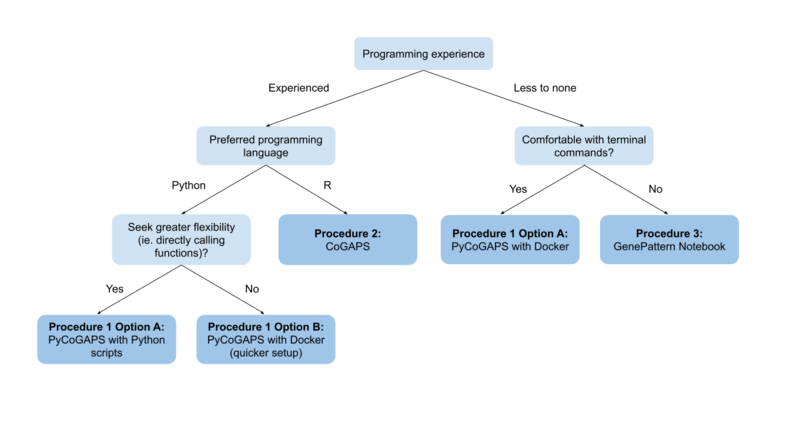

---

layout: page
title: Python API
subtitle: User startup guide for the Python CoGAPS API
hero_image: /CoGAPS/images/hero.jpg
<!-- hero_height: is-fullwidth -->
hero_darken: true
show_sidebar: false
hero_link: https://github.com/FertigLab/pycogaps
hero_link_text: PyCoGAPS GitHub Repository
<!-- callouts: procedureone_callouts -->

---

# Python API

## User startup guide for the Python CoGAPS API

We provide two options for running PyCoGAPS (Options A and B). Both options are functionally equivalent, so the user’s choice of interface should depend on factors such as familiarity with Python and desire for flexibility and modification. Please refer to the **decision tree** below to determine which option is most appropriate to follow.

### [Option A: Python Scripts](/CoGAPS/optiona)
<ul>
  <li>Running PyCoGAPS as a package in a Python script with an IDE</li>
  <li>Provides a full walkthrough of PyCoGAPS package functions</li>
  </ul> 

### [Option B: Docker](/CoGAPS/optionb)
<ul>
  <li>Automatic deployment and running NMF using a Docker image</li>
  <li>Deploy and run PyCoGAPS in fewer steps with limited flexibility</li>
  </ul>

## Decision Tree

## Workflow Comparison

| **Procedure Choice**               | **<a href="https://github.com/FertigLab/pycogaps">Procedure 1: PyCoGAPS</a>** |                                                                        |
|------------------------------------|--------------------------------------------------------------|------------------------------------------------------------------------|
| Option Choice                      | **<a href="/CoGAPS/optiona">Option A: Python Scripts</a>**   | **<a href="/CoGAPS/optionb">Option B: Docker</a>**                     |
| Overview                           | Write and call functions in any Python supported IDE.        | Easily plug in parameters and run code in a prepared Docker container. |
| Preferred programming language     | Python                                                       | Python / no preference                                                 |
| Recommended programming experience | Experienced                                                  | Little to none                                                         |
| Install dependencies?              | Yes                                                          | No                                                                     |
| Customization flexibility          | High                                                         | Limited                                                                |
| Parameter handling                 | Call functions                                               | Easy plug-in                                                           |
| Run location                       | Locally or own server                                        | Locally or own server                                                  |

