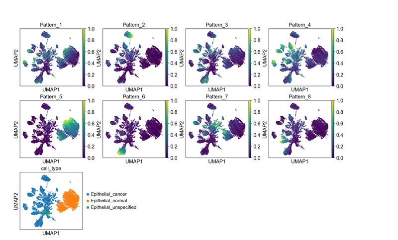

---

hero_image: /jubilant-bassoon/images/hero.jpg
<!-- hero_height: is-fullwidth -->
hero_darken: true

---

# Procedure 1: Running PyCoGAPS -- User startup guide for the Python CoGAPS API

We provide two options for running PyCoGAPS (Options A and B). Option A demonstrates running PyCoGAPS as a package in a Python script with an IDE, and Option B demonstrates automatic deployment and running NMF using a Docker image. Both options are functionally equivalent, so the user’s choice of interface should depend on factors such as familiarity with Python and desire for flexibility and modification. Option A provides a full walkthrough of PyCoGAPS package functions. However, to deploy and run PyCoGAPS in fewer steps with limited flexibility, we recommend following Option B. Please refer to Fig. 4 and/or Table 1 to determine which option is most appropriate to follow. 

## Option A

### Software Setup

<strong>Timing: 5-10 min</strong>

1 . To download PyCoGAPS from GitHub with all data included (~2 GB memory), please run the following command, otherwise to omit the data, please refer to Box 2:

git clone <a href="https://github.com/FertigLab/pycogaps.git" target="_blank">https://github.com/FertigLab/pycogaps.git</a> --recursive

?Troubleshooting

<strong>Box 2</strong>

---

To download PyCoGAPS without the large files (inputresult.h5ad and cogapsresult.h5ad), run the following command:

```yml
GIT_LFS_SKIP_SMUDGE=1 git clone https://github.com/FertigLab/pycogaps.git --recursive
```

Please note that if you would like to use the files (inputresult.h5ad and cogapsresulth5ad) later, you may download them from the repository as described in the Data section.

---

Expected output:

```yml
Cloning into 'pycogaps'...
remote: Enumerating objects: 1570, done.
remote: Counting objects: 100% (290/290), done.
remote: Compressing objects: 100% (191/191), done.
remote: Total 1570 (delta 160), reused 154 (delta 97), pack-reused 1280
Receiving objects: 100% (1570/1570), 8.97 MiB | 15.06 MiB/s, done.
Resolving deltas: 100% (950/950), done.
Filtering content: 100% (4/4), 2.29 GiB | 21.49 MiB/s, done.
Submodule 'src/CoGAPS' (https://github.com/FertigLab/CoGAPS.git) registered for path 'src/CoGAPS'
Cloning into '/Users/fertiglab/pycogaps/src/CoGAPS'...
remote: Enumerating objects: 16976, done.        
remote: Counting objects: 100% (343/343), done.        
remote: Compressing objects: 100% (156/156), done.        
remote: Total 16976 (delta 201), reused 312 (delta 187), pack-reused 16633        
Receiving objects: 100% (16976/16976), 177.58 MiB | 6.10 MiB/s, done.
Resolving deltas: 100% (10621/10621), done.
Submodule path 'src/CoGAPS': checked out 'e1e002caa009866d41402f3aa5ad3f97b541d962'
```

2 . Install the required package dependencies with the following command. We recommend installing these dependencies in an Anaconda<sup>2</sup> environment(Box 3):

```yml
cd pycogaps
pip install -r requirements.txt
```

<strong>Box 3: Anaconda Environment</strong>

---

Install Anaconda from here: <a href="https://docs.anaconda.com/anaconda/install/" target="_blank">docs.anaconda.com/anaconda/install/</a>

Instructions for setting up a conda environment can be found here: <a href="https://conda.io/projects/conda/en/latest/user-guide/getting-started.html" target="_blank">conda.io/projects/conda/en/latest/user-guide/getting-started.html</a>

We recommend the user create a conda environment called ‘pycogaps’ and install all requirements and run code from within here.

---

?Troubleshooting

Now run the setup script. This installs the C++ core CoGAPS library.

```yml
python3 setup.py install
```

When PyCoGAPS has installed and built correctly, you should see this message, indicating PyCoGAPS is ready to use:

```yml
Finished processing dependencies for pycogaps==0.0.1
```

?Troubleshooting

### Running PyCoGAPS

<strong>[this code can be found in the reference file modsimvignette.py]</strong>

<strong>Timing: 3-5 min</strong>

To ensure PyCoGAPS is running properly on your computer, we will first perform a setup and run on a small, simulated toy dataset (single-cell data analysis will begin in Step 7). 

3 . Import libraries. In your python script (file ending in .py), import the PyCoGAPS functions with the following lines:

```yml
from PyCoGAPS.parameters import *
from PyCoGAPS.pycogaps_main import CoGAPS
import scanpy as sc
```

4 . Load sample data from directory.

```yml
modsimpath = "data/ModSimData.txt"
modsim = sc.read_text(modsimpath)
```

Examining the new modsim object in the python console, we see it is an Anndata object of dimension 25 x 20. 

```yml
modsim
AnnData object with n_obs × n_vars = 25 × 20
```

5 . Next, we will set the parameters to be used by PyCoGAPS. First, we will create a CoParams object, then set parameters with the setParams function. 

```yml
params = CoParams(path=modsimpath)
params.printParams()
```

printParams() displays all parameters currently set for the parameter object. Since we just generated this object using the constructor, all default parameters are currently set.

```yml
-- Standard Parameters --
nPatterns:  3
nIterations:  1000
seed:  0
sparseOptimization:  False
-- Sparsity Parameters --
alpha: 0.01
maxGibbsMass:  100.0
```

Since we want to simulate a full-length run on this very small matrix, we need to change nIterations. Many parameters can be changed at once using this dictionary syntax:

```yml
setParams(params, {
    'nIterations': 50000,
    'seed': 42,
    'nPatterns': 3
})
```

For now, we will only modify the ‘nIterations’, ‘seed’, and ‘nPatterns’ parameters. 
Setting the seed fixes the random number generator so that the stochastic, MCMC algorithm used to solve for the A and P matrices in CoGAPS provides identical solutions between runs. More description of the parameters and parameter tuning can be found in Table 2. 

Verify nIterations was updated as anticipated:

```yml
>> params.printParams()

-- Standard Parameters --
nPatterns:  3
nIterations:  50000
seed:  42
sparseOptimization:  False
-- Sparsity Parameters --
alpha: 0.01
maxGibbsMass:  100.0
```

6 . Since our parameters and data are now ready, we can start our PyCoGAPS run. As a best practice, we recommend always timing CoGAPS runs for your own records.

```yml
start = time.time()
modsimresult = CoGAPS(modsim, params)
print("TIME:", end - start)
```

Since modsim is a small, toy dataset, the expected runtime is only about 3 seconds. Verify that the following output appears:

```yml
This is pycogaps version  0.0.1

Running Standard CoGAPS on provided data object ( 25 genes and 20 samples) with parameters: 


-- Standard Parameters --
nPatterns:  3
nIterations:  50000
seed:  42
sparseOptimization:  False
-- Sparsity Parameters --
alpha: 0.01
maxGibbsMass:  100.0
Data Model: Dense, Normal
Sampler Type: Sequential
Loading Data...Done! (00:00:00)
-- Equilibration Phase --
1000 of 50000, Atoms: 41(A), 37(P), ChiSq: 3076, Time: 00:00:00 / 00:00:00
2000 of 50000, Atoms: 51(A), 39(P), ChiSq: 1764, Time: 00:00:00 / 00:00:00
3000 of 50000, Atoms: 53(A), 41(P), ChiSq: 892, Time: 00:00:00 / 00:00:00
4000 of 50000, Atoms: 50(A), 42(P), ChiSq: 695, Time: 00:00:00 / 00:00:00
5000 of 50000, Atoms: 52(A), 44(P), ChiSq: 519, Time: 00:00:00 / 00:00:00
[ … ]
45000 of 50000, Atoms: 72(A), 51(P), ChiSq: 107, Time: 00:00:00 / 00:00:00
46000 of 50000, Atoms: 78(A), 52(P), ChiSq: 128, Time: 00:00:00 / 00:00:00
47000 of 50000, Atoms: 79(A), 48(P), ChiSq: 95, Time: 00:00:00 / 00:00:00
48000 of 50000, Atoms: 71(A), 56(P), ChiSq: 136, Time: 00:00:00 / 00:00:00
49000 of 50000, Atoms: 72(A), 47(P), ChiSq: 143, Time: 00:00:00 / 00:00:00
50000 of 50000, Atoms: 69(A), 53(P), ChiSq: 131, Time: 00:00:00 / 00:00:00
-- Sampling Phase --
1000 of 50000, Atoms: 74(A), 55(P), ChiSq: 104, Time: 00:00:00 / 00:00:00
2000 of 50000, Atoms: 75(A), 55(P), ChiSq: 123, Time: 00:00:00 / 00:00:00
3000 of 50000, Atoms: 87(A), 49(P), ChiSq: 101, Time: 00:00:00 / 00:00:00
4000 of 50000, Atoms: 82(A), 47(P), ChiSq: 102, Time: 00:00:00 / 00:00:00
5000 of 50000, Atoms: 82(A), 44(P), ChiSq: 100, Time: 00:00:00 / 00:00:00
[ … ]
45000 of 50000, Atoms: 71(A), 52(P), ChiSq: 132, Time: 00:00:01 / 00:00:01
46000 of 50000, Atoms: 68(A), 50(P), ChiSq: 130, Time: 00:00:01 / 00:00:01
47000 of 50000, Atoms: 75(A), 51(P), ChiSq: 140, Time: 00:00:01 / 00:00:01
48000 of 50000, Atoms: 74(A), 51(P), ChiSq: 108, Time: 00:00:01 / 00:00:01
49000 of 50000, Atoms: 74(A), 52(P), ChiSq: 108, Time: 00:00:01 / 00:00:01
50000 of 50000, Atoms: 81(A), 47(P), ChiSq: 108, Time: 00:00:01 / 00:00:01

GapsResult result object with 25 features and 20 samples
3 patterns were learned
```

Now we’ll take a quick look at the result object, to make sure there are two resulting base matrices filled with plausible values.

```yml
>> modsimresult
AnnData object with n_obs × n_vars = 25 × 20
    obs: 'Pattern1', 'Pattern2', 'Pattern3'
    var: 'Pattern1', 'Pattern2', 'Pattern3'
    uns: 'asd', 'psd', 'atomhistoryA', 'atomhistoryP', 'averageQueueLengthA', 'averageQueueLengthP', 'chisqHistory', 'equilibrationSnapshotsA', 'equilibrationSnapshotsP', 'meanChiSq', 'meanPatternAssignment', 'pumpMatrix', 'samplingSnapshotsA', 'samplingSnapshotsP', 'seed', 'totalRunningTime', 'totalUpdates'

>> modsimresult.obs.head()

    Pattern1  Pattern2  Pattern3
0  11.975077  0.101262  0.419482
1  10.741890  0.125388  1.356528
2   8.950110  0.035884  2.792770
3   7.521177  0.019195  3.895204
4   6.137812  0.014312  4.937158

>> modsimresult.var.head()

   Pattern1  Pattern2  Pattern3
0  0.001125  0.000760  0.013232
1  0.075658  0.000514  0.135343
2  0.341718  0.002400  0.604787
3  0.567491  0.004287  1.000000
4  0.391151  0.002598  0.640158
```

This indicates that PyCoGAPS has been set up and run correctly, and we can now proceed to analyzing experimental single-cell data.

### Running PyCoGAPS on Single Cell Data

<strong>this code can be found in the reference file pdacvignette.py]</strong>

<strong>Timing: 5 min - 2 days (depending on whether user runs NMF or uses precomputed result)</strong>

7 . Import necessary libraries wrapped in check (Box 4):

```yml
if __name__ == "__main__":
    		from PyCoGAPS.parameters import *
   		from PyCoGAPS.pycogaps_main import CoGAPS
    		import scanpy as sc
```

---

Box 4: Handling multithreading for single-cell data

Important: Whenever distributed (ie multithreaded) options are used, all calling code <strong>must</strong> be wrapped in a check like this so it will only be called by the parent process. Missing this line will send calling code into infinite recursion. All subsequent calling code, not just the imports, must fall under this check such that it will only be executed when the check succeeds.

NOTE: Single-threaded CoGAPS, such as the run demonstrated above with ModSim data, does not require this check. It is a perfectly valid and correct way to run CoGAPS. We show distributed-friendly code here because it will be relevant to the majority of single-cell analysis users, who stand to gain both in performance and robustness of solution.

---

8 . A single-cell dataset has been provided for this vignette, already located in the ‘data’ folder when we cloned the repository. We will read in the data as an anndata object (Box 5).

```yml
path = "data/inputdata.h5ad"
adata = sc.read_h5ad(path)
```

---

Box 5: Data input format

While CoGAPS can handle multiple data formats, we strongly recommend converting your data to Anndata format using the anndata package61 or another utility designed for translating between data structures62. The returned object will be in Anndata format.

---

9 . It is strongly recommended to normalize data before running PyCoGAPS. The data matrix is stored in Sparse Compressed Row format, and we now decompress and normalize it. Here we make use of the scanpy package<sup>71</sup> to perform log-normalization.

```yml
sc.pp.log1p(adata)

adata.X = adata.X.todense()
sc.pp.log1p(adata)
```

CoGAPS expects genes in .obs and cells in .var, which is the opposite of scanpy’s convention. So after normalizing, we transpose the matrix into CoGAPS expected format. 

```yml
adata = adata.T
```

Now let's examine adata:

```yml
>> adata
AnnData object with n_obs × n_vars = 15219 × 25442
    obs: 'gene_ensembl_ID', 'gene_short_name', 'feature_in_nCells'
    var: 'barcode_raw', 'celltype', 'sample_ID', 'sample_ID_celltype', 'TN', 'TN_manuscript', 'manuscript', 'nCount_RNA', 'nFeature_RNA', 'percent.mt', 'Size_Factor', 'TN_cluster_resolution_5', 'TN_assigned_cell_type', 'TN_assigned_cell_type_immune', 'TN_assigned_cell_type_immune_specific', 'TN_assigned_cell_type_immune_broad', 'cc', 'ccstage', 'Classifier_T_duct', 'Classifier_T_Fibroblast_only', 'Classifier_T_Fibroblast_Stellate'
    uns: 'log1p'
    varm: 'X_aligned', 'X_pca', 'X_umap'
```

This is an anndata object consisting of scRNAseq data from 25,422 Pancreatic epithelial cells, with reads from 15,219 genes. The .obs and .var matrices contain metadata such as gene names, cell annotations, and clustering results.

<strong>!CRITICAL</strong> - Any transformation or scaling you choose to perform on your count matrix must result in all non-negative values due to the core constraint of NMF.

10 . Next we create a parameters object that stores run options in a dictionary format. 

Note that the easiest way to decrease runtime is to run for fewer iterations, and you may want to set nIterations=1000 for a test run before starting a complete CoGAPS run on your data.

```yml
params = CoParams(adata=adata)

setParams(params, {
    'nIterations': 50000,
    'seed': 42,
    'nPatterns': 8,
    'useSparseOptimization': True,
    'distributed': "genome-wide"
})
```

If you are running distributed, you must run this line, and you can specify how many sets will be created and parallelized across, as well as specify cutoffs for how stringently a consensus matrix is determined. 

```yml
params.setDistributedParams(nSets=7)
```

The ‘distributed’ parameter enables parallelization to decrease runtimes which we recommended for most cases. Please refer to Box 6 for how to run distributed PyCoGAPS.

---

<strong>Box 6:</strong> Running Distributed PyCoGAPS

Distributed parameters:

If you wish to run distributed CoGAPS, which we recommend for most cases, set the “distributed” parameter to “genome-wide” (parallelize across genes), or “single-cell” (parallelize across cells). Please see Fig. 3 for a full explanation of the mechanism. 

<sup>cut, minNS,</sup> and <sup>maxNS</sup> control the process of matching patterns across subsets and in general should not be changed from defaults. More information about these parameters can be found in the original papers.

<sup>nSets</sup> controls how many subsets are run in parallel when using the distributed version of the algorithm. Setting <sup>nSets</sup> requires balancing available hardware and run time against the size of your data. In general, <sup>nSets</sup> should be less than or equal to the number of nodes/cores that are available. If that is true, then the more subsets you create, the faster CoGAPS will run - however, some robustness can be lost when the subsets get too small. The general rule of thumb is to set <sup>nSets</sup> so that each subset has between 1000 and 5000 genes or cells in order to give robust results, but ideally we would want as many cells per set as possible. More information on these parameters can be found in Table 2.

If <sup>explicitSets</sup> are not provided, the data will be randomly fragmented into the number of sets specified by <sup>nSets</sup> parameter, with the default being 4. Subsets can also be chosen randomly, but weighted according to a user-provided annotation in parameters <sup>samplingAnnotation</sup> and <sup>samplingWeight</sup>.

---

<strong>!CRITICAL</strong> - If you are using the distributed CoGAPS option, all of your calling code must be wrapped in a check to make sure the main thread is running (demonstrated in Step 7). Otherwise, child processes will attempt to call this code, because none of them actually “know” they are not the main thread. This causes infinite recursion to occur and makes the program unrunnable. 

A description and guide for setting key PyCoGAPS parameters can be found in Table 2. To view the parameter values that have been set, we include a printParams function (Box 7). There are many more additional parameters that can be set depending on your goals, which we invite the reader to explore in our GitHub documentation.

---

<strong>Box 7</strong>: Viewing all Parameters

To see all parameters that have been set, call:

```yml
params.printParams()
```

Expected output:

```yml
running genome-wide. if you wish to perform single-cell distributed cogaps, please run setParams(params, "distributed", "single-cell")
setting distributed parameters - call this again if you change nPatterns

-- Standard Parameters --
nPatterns:  8
nIterations:  50000
seed:  42
sparseOptimization:  True

-- Sparsity Parameters --
alpha: 0.01
maxGibbsMass:  100.0

-- Distributed Parameters --
cut:  8
nSets:  7
minNS:  4
maxNS:  11
```

---

11 . With all parameters set, we are now ready to run PyCoGAPS. Please note that this is the most time-consuming step of the procedure. Timing can take several hours and scales nlog(n) based on dataset size (see Timing section below), as well as the parameter values set for ‘nPatterns’ and ‘nIterations’. Time is increased when learning more patterns, when running more iterations, and when running a larger dataset, with iterations having the largest variable impact on the runtime of the NMF function.

<strong>CRITICAL! -</strong> This step has a long runtime. For users who want to load an already-complete NMF run and proceed to the analysis portion of this vignette, please skip to step 13. 

Otherwise, you may start the run as so:

```yml
   start = time.time()
   result = CoGAPS(adata, params)
   end = time.time()
   print("TIME:", end - start)
```

While CoGAPS is running, you will see periodic status messages, described in Box 8.

---
<strong>Box 8:</strong> PyCoGAPS Status Messages

While CoGAPS is running, you will see periodic status messages saying how many iterations have been completed, the current ChiSq value, and how much time has elapsed out of the estimated total runtime.

```yml
1000 of 50000, Atoms: 5424(A), 21232(P), ChiSq: 138364000, Time: 00:03:47 / 11:13:32
1000 of 50000, Atoms: 5394(A), 20568(P), ChiSq: 133824536, Time: 00:03:46 / 11:10:34
1000 of 50000, Atoms: 5393(A), 21161(P), ChiSq: 133621048, Time: 00:03:51 / 11:25:24
1000 of 50000, Atoms: 5527(A), 22198(P), ChiSq: 137671296, Time: 00:04:00 / 11:52:06
1000 of 50000, Atoms: 5900(A), 20628(P), ChiSq: 137228688, Time: 00:03:58 / 11:46:10

NOTE: when running multithreaded, each thread will output to the console separately. For n threads, you will see each message repeated n times. They may come in different orders
```

---

?Troubleshooting

When the run is finished, CoGAPS will print a message like this:

```yml
GapsResult result object with 5900 features and 20628 samples
8 patterns were learned
AnnData object with n_obs × n_vars = 15219 × 25442
    obs: 'Pattern1', 'Pattern2', 'Pattern3', 'Pattern4', 'Pattern5', 'Pattern6', 'Pattern7', 'Pattern8'
    var: 'Pattern1', 'Pattern2', 'Pattern3', 'Pattern4', 'Pattern5', 'Pattern6', 'Pattern7', 'Pattern8'
    uns: 'asd', 'atomhistoryA', 'atomhistoryP', 'averageQueueLengthA', 'averageQueueLengthP', 'chisqHistory', 'equilibrationSnapshotsA', 'equilibrationSnapshotsP', 'meanChiSq', 'meanPatternAssignment', 'psd', 'pumpMatrix', 'samplingSnapshotsA', 'samplingSnapshotsP', 'seed', 'totalRunningTime', 'totalUpdates'
    varm: 'X_aligned', 'X_pca', 'X_umap'
```

12 . When CoGAPS has finished running, write the NMF result to disk. We strongly recommend saving your result object as soon as it returns. 

You can do this by directly saving the anndata object (Box 9):

```yml
result.write("data/my_pdac_result.h5ad")
```

To save as a .csv file, use the following line:

```yml
result.write_csvs(dirname=’./’, skip_data=True, sep=',')
```

---

<strong>Box 9: The PyCoGAPS Result Object</strong>

The CoGAPS result is returned in Anndata format. CoGAPS stores the lower-dimensional representation of the samples (P matrix) in the <sup>.var</sup> slot and the weight of the features (A matrix) in the <sup>.obs</sup> slot. If you transpose the matrix before running CoGAPS, the opposite will be true. Running single-cell is equivalent in every way to transposing the data matrix and running single-cell. The standard deviation across sample points for each matrix as well as additional metrics are stored in the <sup.uns</sup> slots. Please refer to <a href="https://github.com/FertigLab/pycogaps#readme" target="_blank">github.com/FertigLab/pycogaps#readme</a> for complete documentation of output metrics.

---

<strong>PAUSE POINT</strong> - Now we have successfully generated and saved a CoGAPS result. The procedure may be paused. 

The following steps will walk through analyzing and visualizing the generated saved result.

### Analyzing the PyCoGAPS Result

<strong>[reference code can be found in the file analyzepdac.py]</strong>

<strong>Timing: 20-30 min</strong>

13 . We will first load the saved result file, which can be your own NMF result generated from the previous step, or the precomputed one supplied in our repository:

To use precomputed result:

```yml
import anndata
import pandas as pd
import scanpy as sc

cogapsresult = anndata.read_h5ad("data/cogapsresult.h5ad")
```
?Troubleshooting

To use your own object, simply replace the path with your own.

To look at the object:

```yml
>> cogapsresult

AnnData object with n_obs × n_vars = 15176 × 25442
    obs: 'Pattern_1', 'Pattern_2', 'Pattern_3', 'Pattern_4', 'Pattern_5', 'Pattern_6', 'Pattern_7', 'Pattern_8'
    var: 'Pattern_1', 'Pattern_2', 'Pattern_3', 'Pattern_4', 'Pattern_5', 'Pattern_6', 'Pattern_7', 'Pattern_8', 'cell_type'
```

Now, we are ready to call built-in PyCoGAPS functions to analyze and visualize the data.

<strong>Note:</strong> Please see “Anticipated Results” section for more discussion of the result object

14 . We will visualize patterns and compare it with clusters and annotations using UMAP and the scanpy package. <a href="https://scanpy-tutorials.readthedocs.io/en/latest/pbmc3k.html" target="_blank">scanpy-tutorials.readthedocs.io/en/latest/pbmc3k.html</a>

We provide a wrapper function to perform basic clustering workflow in scanpy (all default parameters) and produce a plot of each pattern’s intensity displayed on the data’s UMAP embedding.

Import analysis functions module (decoupled from NMF module)

```yml
from PyCoGAPS.analysis_functions import *
```

<strong>! CRITICAL -</strong> If you are at this step following the Docker procedure (Option B), you should have already imported analysis_functions, and do not need to include the line above (ie. you do not need to install the PyCoGAPS dependency).

Call wrapper function:

```yml
plotPatternUMAP(cogapsresult)
```

Expected output in python console:

```yml
scanpy==1.9.1 anndata==0.7.8 umap==0.5.3 numpy==1.23.5 scipy==1.10.0 pandas==1.2.4 scikit-learn==1.0.1 statsmodels==0.13.5 pynndescent==0.5.8
extracting highly variable genes
    finished (0:00:01)
--> added
    'highly_variable', boolean vector (adata.var)
    'means', float vector (adata.var)
    'dispersions', float vector (adata.var)
    'dispersions_norm', float vector (adata.var)
/Users/fertiglab/pycogaps/venv/lib/python3.10/site-packages/scanpy/preprocessing/_simple.py:843: UserWarning: Received a view of an AnnData. Making a copy.
  view_to_actual(adata)
computing PCA
    on highly variable genes
    with n_comps=50
    finished (0:00:15)
computing neighbors
    using 'X_pca' with n_pcs = 50
    finished: added to `.uns['neighbors']`
    `.obsp['distances']`, distances for each pair of neighbors
    `.obsp['connectivities']`, weighted adjacency matrix (0:00:00)
computing UMAP
    finished: added
    'X_umap', UMAP coordinates (adata.obsm) (0:00:07)
WARNING: saving figure to file figures/umapepithelial_pycogaps_UMAP.png
```


