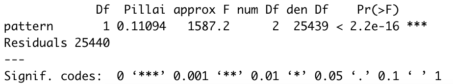

---

hero_image: /CoGAPS/images/hero.jpg
<!-- hero_height: is-fullwidth -->
hero_darken: true
subtitle: User Startup Guide
hero_link: https://www.bioconductor.org/packages/devel/bioc/vignettes/CoGAPS/inst/doc/CoGAPS.html
hero_link_text: CoGAPS Bioconductor Vignette
toc: true

---

# R CoGAPS API

## Software Setup

<strong>Timing: 1-5 minutes</strong>

1 . CoGAPS can be installed directly from the **FertigLab GitHub Repository** using R devtools:

```r
devtools::install_github("FertigLab/CoGAPS")
```

When CoGAPS has installed correctly, you will see this message:

```yml
** installing vignettes
** testing if installed package can be loaded from temporary location
** checking absolute paths in shared objects and dynamic libraries
** testing if installed package can be loaded from final location
** testing if installed package keeps a record of temporary installation path
* DONE (CoGAPS)
```

<strong>R Script Setup</strong>
<strong>Timing: 1 min</strong>

2 . **Import** the CoGAPS library with the following command:

```yml
library(CoGAPS)
```

## Running CoGAPS on Simulated Toy Data

<strong>Timing: 3-5 min</strong>

3 . To ensure CoGAPS is working properly, we will first load in the simulated toy data for a test run. Single-cell data will be loaded later in <a href="/CoGAPS/proceduretwo/#running-cogaps-on-single-cell-data">step 6</a>.

```yml
modsimdata <- read.table("../data/ModSimData.txt")
modsimdata

> head(modsimdata, c(5L, 5L))
        V1      V2     V3     V4     V5
1 0.077764 0.94742 4.2487 7.0608 4.8730
2 0.081467 0.99253 4.4507 7.3906 5.0387
3 0.085170 1.03760 4.6527 7.7204 5.2044
4 0.088873 1.08270 4.8547 8.0502 5.3700
5 0.092576 1.12790 5.0567 8.3800 5.5357

> dim(modsimdata)
[1] 25 20
```

4 . Next, we will **set the parameters** to be used by CoGAPS. First, we will create a **CogapsParams object**, then **set parameters** with the **setParam** function.

```yml
# create new parameters object
params <- new("CogapsParams")

# view all parameters
params

-- Standard Parameters --
nPatterns            7 
nIterations          50000 
seed                 718 
sparseOptimization   FALSE 

-- Sparsity Parameters --
alpha          0.01 
maxGibbsMass   100

# get the value for a specific parameter
getParam(params, "nPatterns")
[1] 7

# set the value for a specific parameter
params <- setParam(params, "nPatterns", 3)

getParam(params, "nPatterns")
[1] 3
```

5 . **Run** CoGAPS on the **ModSim** data. Since this is a small dataset, the expected runtime is only about 5-10 seconds.

```yml
cogapsresult <- CoGAPS(modsimdata, params, outputFrequency = 10000)
```

**Verify** that this output appears:

```yml
This is CoGAPS version 3.19.1 
Running Standard CoGAPS on modsimdata (25 genes and 20 samples) with parameters:

-- Standard Parameters --
nPatterns            3 
nIterations          50000 
seed                 622 
sparseOptimization   FALSE 

-- Sparsity Parameters --
alpha          0.01 
maxGibbsMass   100 

Data Model: Dense, Normal
Sampler Type: Sequential
Loading Data...Done! (00:00:00)
-- Equilibration Phase --
10000 of 50000, Atoms: 59(A), 49(P), ChiSq: 245, Time: 00:00:00 / 00:00:00
20000 of 50000, Atoms: 68(A), 46(P), ChiSq: 188, Time: 00:00:00 / 00:00:00
30000 of 50000, Atoms: 80(A), 47(P), ChiSq: 134, Time: 00:00:00 / 00:00:00
40000 of 50000, Atoms: 69(A), 46(P), ChiSq: 101, Time: 00:00:00 / 00:00:00
50000 of 50000, Atoms: 76(A), 53(P), ChiSq: 132, Time: 00:00:00 / 00:00:00
-- Sampling Phase --
10000 of 50000, Atoms: 82(A), 52(P), ChiSq: 94, Time: 00:00:00 / 00:00:00
20000 of 50000, Atoms: 74(A), 54(P), ChiSq: 144, Time: 00:00:01 / 00:00:01
30000 of 50000, Atoms: 79(A), 47(P), ChiSq: 116, Time: 00:00:01 / 00:00:01
40000 of 50000, Atoms: 79(A), 46(P), ChiSq: 132, Time: 00:00:01 / 00:00:01
50000 of 50000, Atoms: 76(A), 48(P), ChiSq: 124, Time: 00:00:01 / 00:00:01
```

This means that **the underlying C++ library has run correctly**, and everything is installed how it should be. We now **examine** the result object.

```yml
> cogapsresult
[1] "CogapsResult object with 25 features and 20 samples"
[1] "3 patterns were learned"
> cogapsresult@sampleFactors
       Pattern_1    Pattern_2    Pattern_3
V1  8.388746e-03 0.0062945839 0.0007746686
V2  8.932892e-02 0.1355465055 0.0005277477
V3  3.992884e-01 0.6105546355 0.0019834286
V4  6.626218e-01 0.9999989867 0.0034138400
V5  4.499646e-01 0.6090151072 0.0021458515
V6  3.541442e-01 0.1354408264 0.0014731999
V7  7.266073e-01 0.0057070116 0.0048238179
V8  1.000000e+00 0.0058223484 0.0046370891
V9  7.166106e-01 0.0046964670 0.0032584930
V10 2.641986e-01 0.0020137667 0.0012293814
V11 5.295977e-02 0.0005939197 0.0074665351
V12 1.486760e-03 0.0009508047 0.1134860739
V13 2.749619e-04 0.0005655847 0.3701201081
V14 3.304514e-04 0.0020806976 0.7812449932
V15 4.917108e-04 0.0038944422 1.0000000000
V16 3.356318e-04 0.0017714981 0.7815062404
V17 2.180223e-04 0.0006926730 0.3694530129
V18 1.647724e-04 0.0002741633 0.1056895107
V19 7.622870e-04 0.0013716018 0.0139522608
V20 5.930163e-05 0.0004655297 0.0001998204

> cogapsresult@featureLoadings
        Pattern_1   Pattern_2 Pattern_3
Gene_1  11.541452 0.003959592 0.1725101
Gene_2  11.458824 0.011860452 0.3962909
Gene_3  11.200215 0.143655315 0.5942768
Gene_4  10.484943 0.919701695 0.7919101
Gene_5   9.622066 1.971993566 0.9882591
Gene_6   8.901559 2.780912161 1.1860518
Gene_7   8.183671 3.564562798 1.3833313
Gene_8   7.455255 4.367302418 1.5811858
Gene_9   6.721270 5.166158199 1.7781062
Gene_10  5.993835 5.958409309 1.9737232
Gene_11  6.339371 0.005076513 6.1401019
Gene_12  7.336598 0.066603549 5.9148746
Gene_13  8.051244 0.530350804 5.6913567
Gene_14  8.588865 1.326142669 5.4673815
Gene_15  9.184795 2.006909609 5.2382684
Gene_16  9.830432 2.598231554 5.0155287
Gene_17 10.490241 3.181848764 4.7880602
Gene_18 11.132268 3.768204927 4.5618424
Gene_19 11.772452 4.362468243 4.3355570
Gene_20 12.417335 4.943210602 4.1082892
Gene_21 13.053541 5.535136700 3.8799365
Gene_22 13.705083 6.107748985 3.6509578
Gene_23 14.347120 6.697602272 3.4237635
Gene_24 14.986680 7.265126705 3.1958113
Gene_25 15.624031 7.858362675 2.9668522
```

If both matrices--sampleFactors and featureLoadings--have reasonable values like this, we have confidence that **CoGAPS is working as expected**. We now continue with single-cell analysis.

## Running CoGAPS on Single Cell Data

<strong>Timing: 5 min - 2 days (depending on whether user runs NMF or uses precomputed result)</strong>

6 . We will now **read in** the single cell dataset, which we will demonstrate with the provided input file in the repository.

```yml
pdac_data <- readRDS("inputdata.rds")


> pdac_data
An object of class Seurat 
15184 features across 25442 samples within 2 assays 
Active assay: originalexp (15176 features, 2000 variable features)
 1 other assay present: CoGAPS
 5 dimensional reductions calculated: PCA, Aligned, UMAP, pca, umap
```

We also want to extract the counts matrix to provide directly to CoGAPS

```yml
pdac_epi_counts <- as.matrix(pdac_data@assays$originalexp@counts)
```

7 . Most of the time we will set some parameters before running CoGAPS. Parameters are managed with a **CogapsParams** object. This object will store all parameters needed to run CoGAPS and provides a simple interface for viewing and setting the parameter values

```yml
library(CoGAPS)
pdac_params <- CogapsParams(nIterations=100, # run for 100 iterations 
               	seed=42, # for consistency across stochastic runs
               	nPatterns=8, # each thread will learn 8 patterns
                  sparseOptimization=TRUE, # optimize for sparse data
                  distributed="genome-wide") # parallelize across sets
```

If you wish to run **distributed CoGAPS**, which is recommended to improve the computational efficiency for most large datasets, you must also call the **setDistributedParams** function. For a complete description of the parallelization strategy used in distributed CoGAPS, please refer to the section titled “**Finding robust patterns using consensus across parallel sets**”, as well as [Fig. 3](/CoGAPS/troubleshooting/#procedure-2).

```yml
> pdac_params <- setDistributedParams(pdac_params, nSets=7)
setting distributed parameters - call this again if you change nPatterns
```

**Box 15** demonstrates viewing all parameters and their values that have been set.

---

<strong>Box 15: Viewing all parameters</strong>

```yml
> pdac_params
-- Standard Parameters --
nPatterns            8 
nIterations          100 
seed                 42 
sparseOptimization   TRUE 
distributed          genome-wide 

-- Sparsity Parameters --
alpha          0.01 
maxGibbsMass   100 

-- Distributed CoGAPS Parameters -- 
nSets          7 
cut            8 
minNS          8 
maxNS          23
```

---

8 . With all parameters set, we are now ready to **run CoGAPS**. Please note that this is the most time-consuming step of the procedure. Timing can take several hours and scales nlog(n) based on dataset size (see **Timing** section below), as well as the parameter values set for ‘**nPatterns**’ and ‘**nIterations**’. Time is increased when learning more patterns, when running more iterations, and when running a larger dataset, with iterations having the largest variable impact on the runtime of the NMF function.

<strong>CRITICAL! -</strong>This step has a long runtime. For users who want to load an already-complete NMF run and proceed to the analysis portion of this vignette, please **skip to step 13**. 

Otherwise, you may start the run as so:

```yml
startTime <- Sys.time()
  
pdac_epi_result <- CoGAPS(pdac_epi_counts, pdac_params)
endTime <- Sys.time()

saveRDS(pdac_epi_result, “../data/pdac_epi_cogaps_result”)

To save as a .csv file, use the following line:

   saveCSV(pdac_epi_result, “path/to/location/pdac_epi_result.csv”)
```

While CoGAPS is running it periodically prints status messages (**Box 16**). 

<p style="margin-left: 25px;">
<a href="/CoGAPS/troubleshooting/#procedure-2" target="_blank">TROUBLESHOOTING</a>
</p>
        
---

<strong>Box 16: CoGAPS Status Messages:</strong>

```yml
20000 of 25000, Atoms: 2932(80), ChiSq: 9728, time: 00:00:29 / 00:01:19
```

This message tells us that CoGAPS is at iteration 20000 out of 25000 for this phase and that 29 seconds out of an estimated 1 minute 19 seconds have passed. It also tells us the size of the atomic domain which is a core component of the algorithm but can be ignored for now. Finally, the ChiSq value tells us how closely the A and P matrices reconstruct the original data. In general, we want this value to go down - but it is not a perfect measurement of how well CoGAPS is finding the biological processes contained in the data. CoGAPS also prints a message indicating which phase is currently happening. There are two phases to the algorithm - **Equilibration** and **Sampling**.

---

## Analyzing the CoGAPS Result

9 . Now that the CoGAPS run is complete, learned patterns can be investigated. Due to the stochastic nature of the MCMC sampling in CoGAPS and long run time, it is generally a good idea to **immediately save** your CoGAPS result object to a file to have (**Box 17**), then **read it in** for downstream analysis. 

If you wish to **load** and **examine** a precomputed result object, please do so by:

```yml
cogapsresult <- readRDS("data/cogapsresult.Rds")
> cogapsresult
[1] "CogapsResult object with 15176 features and 25442 samples"
[1] "8 patterns were learned"

To load your own result, simply edit the file path:
cogapsresult <- readRDS(“../data/pdac_epi_cogaps_result.Rds”)
```

---

<strong>Box 17: The CoGAPS result object consists of:</strong>

A and P matrices learned by CoGAPS. In this package, the A matrix of sample weights is called “<strong>sampleFactors</strong>” and the P matrix of gene weights is called “<strong>featureLoadings</strong>”.

Standard deviation matrices <strong>factorStdDev</strong> and <strong>loadingStdDev</strong> corresponding to sampleFactors and featureLoadings

Metadata, which contains information for the run such as how it was parallelized (<strong>subsets</strong>), the mean ChiSq value during the run (<strong>meanChiSq</strong>), and the parameters used in the run (<strong>params</strong>). Since the run parameters are attached to the result object, it can keep track of the provenance of your CoGAPS results. Other information may be present in the metadata depending on your run options.


---

PAUSE POINT - Now we have successfully **generated** and **saved** a CoGAPS result. The procedure may be **paused**. 

The following steps will walk through **analyzing** and **visualizing** the generated saved result.

<strong>Note</strong>: Please see “[Anticipated Results](/CoGAPS/anticipatedresults)” section for more discussion of the result object

10 . It is recommended to **immediately visualize** pattern weights on a UMAP because you will immediately see whether they are showing strong signal and make common sense. 

Since pattern weights are all continuous and nonnegative, they can be used to color a UMAP in the same way as one would color by gene expression. The sampleFactors matrix is essentially just <em>nPatterns</em> different annotations for each cell, and featureLoadings is likewise just <em>nPatterns</em> annotations for each gene. This makes it very simple to incorporate pattern data into any data structure and workflow. 

To store CoGAPS patterns as an Assay within a Seurat object (recommended):

```yml
# make sure pattern matrix is in same order as the input data
patterns_in_order <-t(cogapsresult@sampleFactors[colnames(pdac_data),])

# add CoGAPS patterns as an assay
pdac_data[["CoGAPS"]] <- CreateAssayObject(counts = patterns_in_order)
```

With the help of Seurat’s FeaturePlot function, we generate a UMAP embedding of the cells colored by the intensity of each pattern. 

```yml
DefaultAssay(inputdata) <- "CoGAPS"
pattern_names = rownames(inputdata@assays$CoGAPS)

library(viridis)
color_palette <- viridis(n=10)

FeaturePlot(inputdata, pattern_names, cols=color_palette, reduction = "umap") & NoLegend()
```


11 . To assess pattern marker genes, we provide a patternMarkers() CoGAPS function to find genes associated with each pattern and returns a dictionary of information containing lists of marker genes, their ranking, and their “score” for each pattern. This is **vital** because genes are often associated with multiple patterns.

patternMarkers can run in two modes, depending on the “threshold” parameter

If <strong>threshold=”all”</strong>, each gene is treated as a marker of one pattern (whichever it is most strongly associated with). The number of marker genes will always equal the number of input genes. If <strong>threshold=”cut”</strong>, a gene is considered a marker of a pattern if and only if it is less significant to at least one other pattern. Counterintuitively, this results in much shorter lists of patternMarkers and is a more convenient statistic to use when functionally annotating patterns.

```yml
pm <- patternMarkers(cogapsresult, threshold="cut")
```

The three components of the returned dictionary pm are:

<ul>
<li>PatternMarkers</li>
    <ul>
        <li>a list of marker genes for each pattern</li>
        <li>Can be determined using two threshold metrics--see below, and the section of the text called “Assessing the biological function of gene signatures from the amplitude matrix”</li>
        </ul>
<li>PatternMarker Rank</li>
    <ul>
        <li>each gene ranked by association for each pattern</li>
        <li>Whole natural numbers, assigning each marker gene a place in the rank for each pattern</li>
        <li>Lower rank indicates higher association and vice versa</li>
        </ul>
<li>PatternMarkerScores</li>
        <ul>
            <li>scores describing how strongly a gene is associated with a pattern.</li>
            <li>A higher score value indicates the gene is more associated with the pattern, and vice versa</li>
            <li>Scores have nonnegative values mostly falling between 0 and 2</li>
            </ul>
                  </ul>
                  
12 . One way to **explore** and **use** CoGAPS patterns is to conduct gene set enrichment analysis by functionally annotating the genes which are significant for each pattern. 

The PatternHallmarks function provides a wrapper around the fgsea<sup>74</sup> fora method and associates each pattern with msigDB<sup>75</sup> hallmark pathway annotations using the list of marker genes attained from the patternMarkers statistic. 

To perform gene set analysis on pattern markers, please run:

```yml
hallmarks <- PatternHallmarks(cogapsresult)
```

hallmarks is a list of data frames, each containing hallmark overrepresentation statistics corresponding to one pattern. 

To **generate** a histogram of the most significant hallmarks for any given pattern, please **run**:

```yml
pl_pattern7 <- plotPatternHallmarks(hallmarks, whichpattern = 7)

pl_pattern7
```


Previously we observed pattern 7 to be associated with a mixture of cancer and adjacent-normal epithelial cells. Now we see the marker genes of this pattern are significantly overrepresented in hallmark gene sets of inflammatory response and allograft rejection. We looked at how this pattern in epithelial cells varied between samples, and found it to be correlated with the presence of fibroblasts in the sequenced tumor biopsy sample. We hypothesized that pattern 7 represents a process of epithelial cell carcinogenesis, a transitional, inflammatory phenotype urged on by other cells in the tumor microenvironment, and tested this hypothesis in our lab using PDAC organoid and cancer-associated fibroblast co-culture experiments<sup>1</sup>.

13 . To generate statistics on the association between certain sample groups and patterns, we provide a wrapper function, called **runMANOVA**. This will allow us to explore if the patterns we have discovered lend to statistically significant differences in the sample groups. We will first **load in** the original data (if not already done earlier): 

```yml
pdac_data <- readRDS("inputdata.rds")
```

Then, **create** a new matrix called “**interestedVariables**” consisting of the metadata variables of interest in conducting analysis on.

```yml
interestedVariables <- cbind(pdac_data@meta.data[["celltype"]], pdac_data@meta.data[["TN_assigned_cell_type"]])
```

Lastly, **call** the wrapper function, **passing in** the result object as well.

```yml
manovaResult <- MANOVA(interestedVariables, cogapsresult)
```

The function will **print out** the MANOVA results for each pattern learned based on the variables of interest. From the output, we can observe that all p-values have a value of 0.0, indicating that differences observed in the sample groups based on the patterns are **statistically significant**. 


